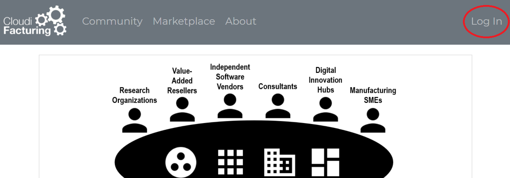
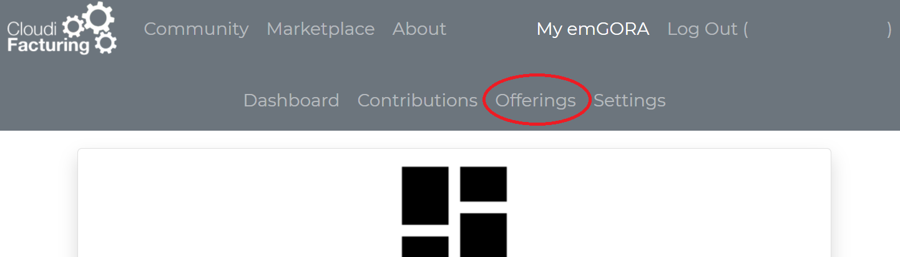
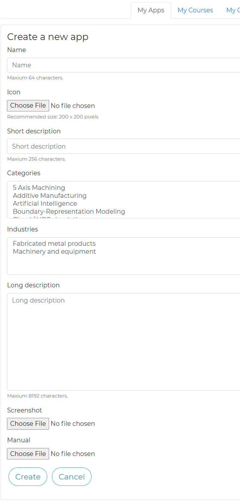
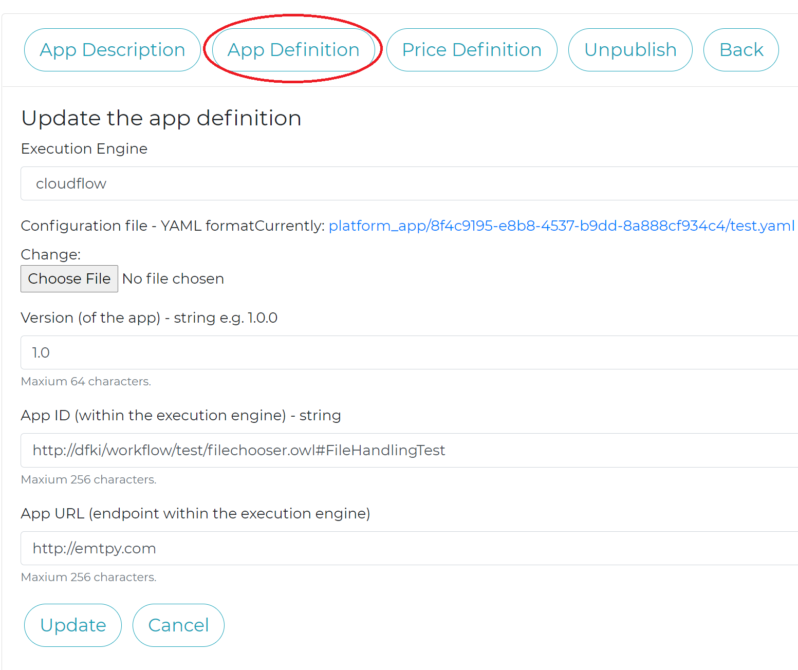
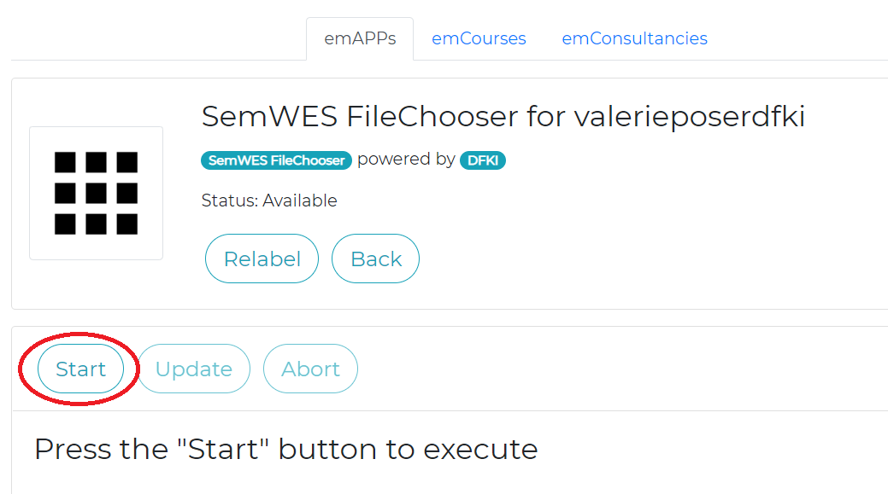
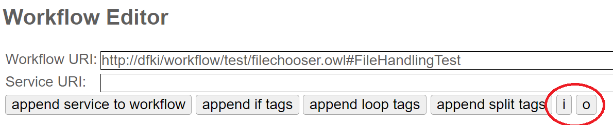
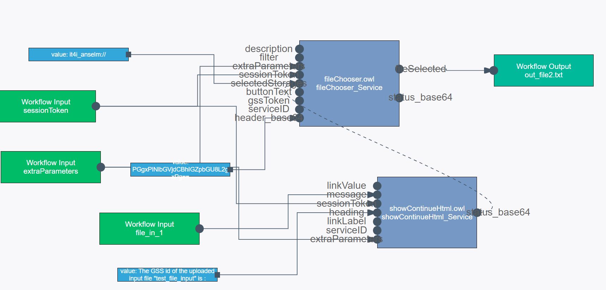

# emGORA Integration

SemWES workflows can rather easily be integrated into the emgora marketplace (https://cfg.emgora.eu), however there are a few points to respect.

## Topics:
* [User registration](#registration)
* [Workflow registration](#workflow-registration)
* [Workflow execution](#workflow-execution)
* [File handling through emGORA](#file-handling)

---
# Registration

## User registration at emgora
The very first step to interact with the emGORA marketplace is to register:

* Therefore, click "Log In" on the landing page (top right corner):

* Then, click "Register" at the very bottom.

* Fill in the required information and click "Register" again.

## Register emGORA user with SemWES
The registration of the emgora username with SemWES is only required for executing SemWES workflows through emgora.

To match the emgora username with your SemWES project, currently a manual step is required. Please send your "emgora username" and your "SemWES project" (used when logging in to the platform) to [Valerie]((mailto:valerie.poser@dfki.de)).

In the meantime, you can already go ahead and register your workflow in the emGORA.

---
# Workflow registration

## App registration - App Details
To register your workflow in the emGORA, please navigate to "My emGORA" (top left corner), "Offerings", and click "Create App".

Here you can provide the name of your app, set an icon, select categories, and provide descriptions, screenshots and manuals.

Once you have filled in all information, click "Create".

From now on those information will be referred to as "App Description", you can always edit them in the respective tab.

## App Definition

In the tab "App Definition" you can create the link to your SemWES workflow, by entering the following mandatory details:
* ***Execution Engine***, enter `cloudflow`.
* ***Configuration file***, upload a dummy file "default.yaml", with some arbitrary content, e.g. "empty" (This file is not used by the SemWES engine, but required by the emgora).
* ***App Version***, enter a version number of your choosing, e.g. '1.0.0' (no equivalent in SemWES, and not used by SemWES).
* ***App ID***, enter the full Workflow URI of your workflow, e.g. `http://dfki/workflow/test/filechooser.owl#FileHandlingTest`.
* ***App URL***, enter an arbitrary URL of your choosing, e.g. 'http://emtpy.com' (no equivalent in SemWES, and not used by SemWES).

## Price Definition
This feature is currently still in development. Please check back at a later time.

---
# Workflow execution
Before executing your workflow, please ensure that you have [registered your emgora username with SemWES](#register-emgora-user-with-Semwes).

## App Execution
To execute an app, navigate to "Marketplace" (top left corner), "emAPPs", and click on the desired app.

Then, click on "Add to dashboard", and "Go to dashboard".

There you manage your App instances. In the upper part you should see your newly added app under "emApps to be started", click it.

Now you have finally arrived at the execution monitoring interface, where you can "Start", and "Abort" the execution of this app/workflow instance. The "Update" button can be used to refresh the status of the app, but should not be necessary for SemWES.

After clicking "Start", and waiting patiently, you should see the familiar UI from the SemWES portal.

---
# File handling

The emGORA also offers interfaces to up and download files, before and after the execution of an app.

To prepare your workflow to make use of this feature, please stick to the following guidelines:

* Only workflow inputs and outputs will be made available in the emGORA, in the SemWES WorkflowEditor click on "i" or "o" below the "ServiceURI" field to add a workflow input or output.

* Additionally, the workflow inputs and outputs have to be named adequately: Double-click a workflow input or output and select "edit"(middle icon) to change the parameter name. To be offered correctly in the emGORA interface the parameters have to include "`file`" somewhere in their parameter name, e.g `file_in_1`.

## Example workflow

As a simple example, have a look at the FileHandlingTest-Workflow (http://dfki/workflow/test/filechooser.owl#FileHandlingTest).

It defines a workflow input "file_in_1", and a output "out_file2.txt":

It is registered in the emGORA as "
SemWES FileChooser".
