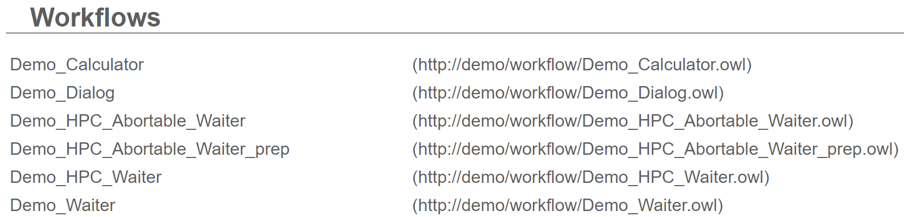

# Tutorial: Overview over the portal GUI

In this tutorial we will get to know the GUI, start a workflow and inspect its results.

## Step 1 - Navigation
For the hands-on session the relevant subpages are __Available Experiments__, __Running Experiments__, __Finished Experiments__ and __Workflow Editor__, which can be found via the navigation bar.

## Step 2 - Inspecting available workflows
1. Select __Available Experiments__ in the navigation bar, which will lead you to the following view:

2. Here, you can see a list of available workflows.

## Step 3 - Executing a workflow
1. In the list of available workflows, click on the workflow __Test_waiter__ to start its execution.
3. A new page will open showing the status of this workflow, while it is starting.

4. When the workflow is loaded completely, you can see the current status of the workflow.

## Step 4 - Inspecting a running worklow
1. Close the current page and select __Runnining Experiments__ to show the list of running workflows for the current user.

2. To reopen the workflow's page click on its entry.
- Hint: To abort a running workflow, you could hover over an workflow entry and click the cross at the end of the entry.

## Step 5 - Inspecting finished workflows
1. Once a workflow has finished its execution you should see its result page.

2. Close this tab and head over to __Finished Experiments__.

4. If you click on the Workflow's entry you will be redirected to the result page, where you can inspect the results of your workflow again.

## Conclusion
Congratulations, you have finished the first tutorial. You should now be able to start workflows and examine their status and result